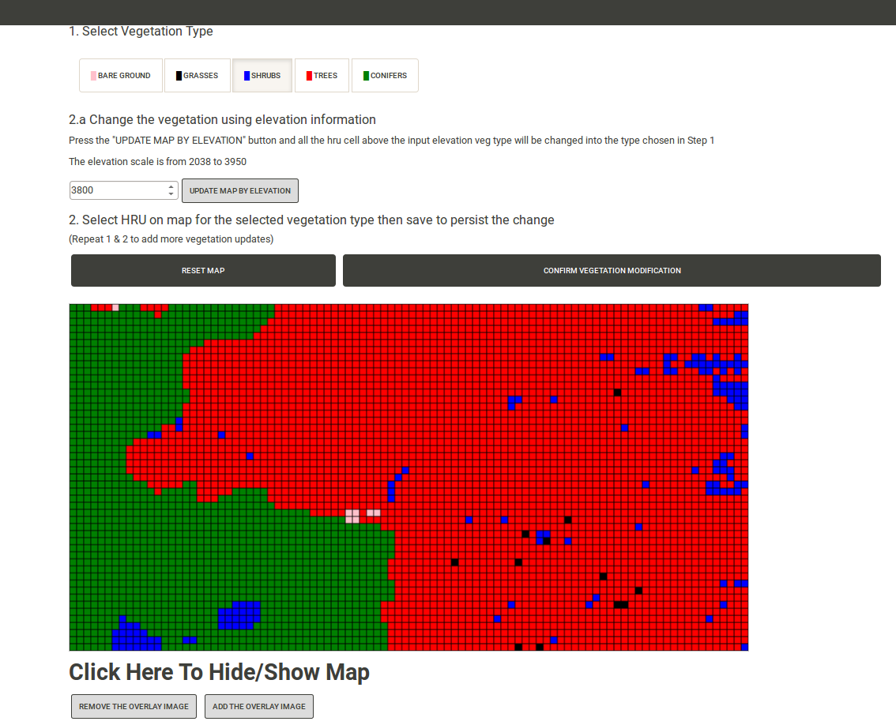

## prms-fire-scenarios

This is used for education and research purpose. Users can set fire and the system will simulate fire (where it goes and when it ends).

# Info and Getting Started

Currently there are some demo routes in [app/api/views.py](https://github.com/VirtualWatershed/prms-fire-scenarios/blob/master/app/api/views.py)
and the Swagger API spec is in [api-spec.yaml](https://github.com/VirtualWatershed/prms-fire-scenarios/blob/master/api-spec.yaml).

After installing dependencies (see below) you can start the python server with `python manage.py runserver` then navigate to
[localhost:5000](http://localhost:5000) and you should see the screen below:




#### Dependencies

There are a couple of things to do first. You must have Python, MongoDB, and
the Javascript dependency manager [Bower](http://bower.io). For MongoDB, do a
standard install with the server running on port 27017.
Please do an internet search on how to install these for your particular system.
After you have those installed, run

```
bower install
```

to install the Javascript dependencies.

Next install the Python dependencies using

```
pip install -r requirements.txt
```

You probably want to be using
[virtual environments](http://docs.python-guide.org/en/latest/dev/virtualenvs/),
though this is not required.

At this point bower has overwritten something in the repository. To put it back,

```
git checkout -- app/static/bower_components/swagger-ui/dist/index.html
```

## Running the App

### Web interface

We are close to our Minimum Viable Product release which includes a working
version of a front-end web interface to the API. To start the development
version of the system, simply run

```
python manage.py runserver
```

If the MongoDB collection is empty (you haven't inserted any documents manually
or run any scenarios), a single record will be inserted as a placeholder for
development purposes. After you start the server, visit
[localhost:5000](http://localhost:5000) to see the web interface. Scroll to the
bottom to view the list of scenarios. There will be a hydrograph in the
`hydrograph` attribute of the JSON that gets delivered to your browser when you
click the `View JSON` link in the list at the bottom.

If you visit [localhost:5000/api/scenarios](http://localhost:5000/api/scenarios)
you will see the list of current scenarios with one current scenario.

API routes are in
[app/api/views.py](https://github.com/VirtualWatershed/prms-fire-scenarios/blob/master/app/api/views.py).


### Run Swagger-UI to see spec

Now, finally, we can run our Swagger-UI and look at the spec by running

```
./serve-swag.sh
```

and visiting [http://localhost:8000/swagger-ui/dist/?url=/../../api-spec.yaml](http://localhost:8000/swagger-ui/dist/?url=/../../api-spec.yaml).

We need to make this spec actually happen. This is the API the frontend and Chase's Unity vis will use to run and access scenarios.
